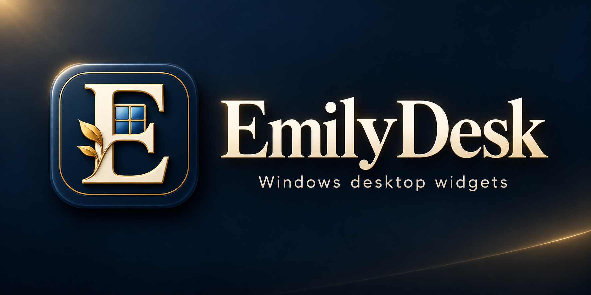
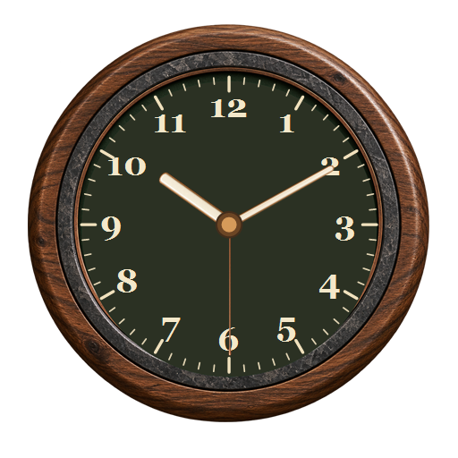
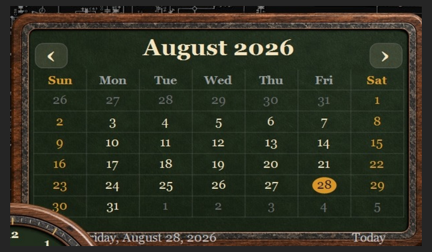
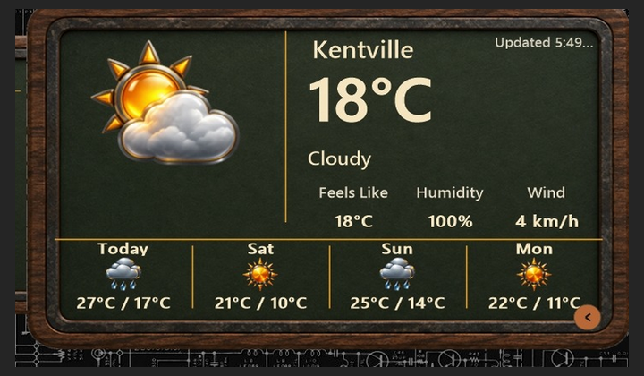
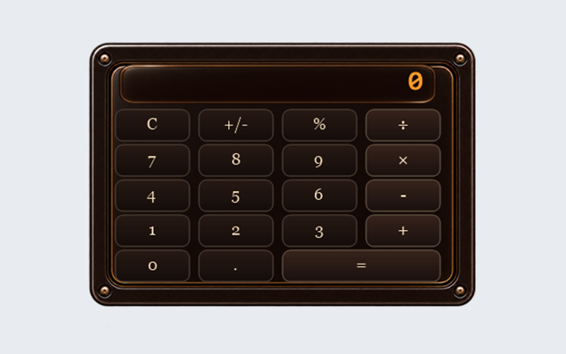
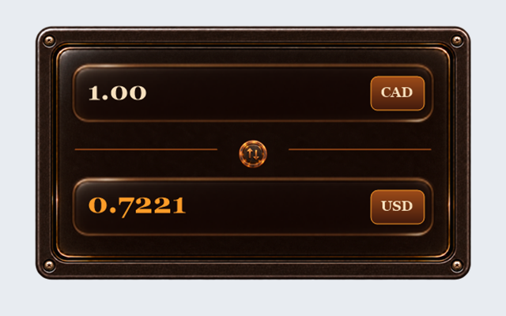

# EmilyDesk

EmilyDesk is a Windows desktop widget application with a dashboard, a visual widget designer, themed clocks, calendars, weather widgets, wallpapers, docks, and a gallery of optional widgets.

## Widget previews

These are the actual preview PNGs included with the source. The live widgets show your own time, location, and system data.

| Clock | Calendar |
|:---:|:---:|
|  |  |

| Weather | Ember Glow calculator | Ember Glow currency converter |
|:---:|:---:|:---:|
|  |  |  |

## Get EmilyDesk

Download the Windows installer from the repository's **Releases** page once a release has been published. The source archive contains the application and optional widget source, artwork, theme packages, and wallpapers. It is not an installer.

The installer is created on Windows by running `Build.cmd`. See [BUILDING.md](BUILDING.md) for prerequisites, the output location, and optional widget packages.

## What's in this repository

- `src/`: application, designer, services, and widget projects.
- `Widgets/`: the main widget packages and their preview artwork.
- `OptionalWidgets/`: optional widgets, including Ember Glow, with their own artwork and previews.
- `ThemePackages/`, `Assets/`, `Wallpapers/`: theme layouts, graphics, and bundled wallpapers.
- `Build.ps1`, `Build.cmd`, `Installer-UserMode.iss`: Windows build and installer sources.
- `docs/history/`: earlier build notes retained for project history.

## Support

If EmilyDesk is useful to you, [support its development through PayPal](https://paypal.me/emzdesk). Donations are optional.

## License

EmilyDesk is released under the [MIT License](LICENSE).
